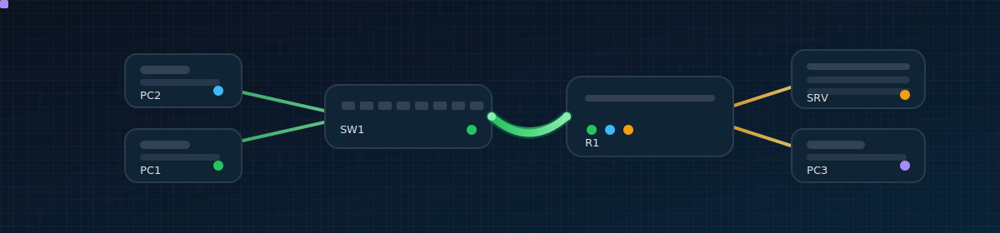

<h2 align="center">Pouria Velaei</h2>
<h4 align="center">Aspiring Network Engineer | CCNA Journey</h4>

Focused on building practical networking labs, mastering routing & switching,  
and exploring network automation with Python.

---

### 🚀 About Me

- 🎓 University student specializing in Networking
- 📚 Currently preparing for the CCNA certification
- 🐧 Daily Linux user (CLI-focused workflow)
- 🐍 Learning Python for network automation
- 🧠 Passionate about simplifying complex networking concepts

---

### 🔬 Current Learning Focus

- IPv4 Addressing & Subnetting
- VLANs & Network Segmentation
- Static & Dynamic Routing Fundamentals
- CCNA Lab Practice (Packet Tracer / GNS3)
- Basic Network Automation with Python

---

### 🛠 Tools & Technologies

  

- Cisco Packet Tracer  
- Linux Environment  
- Python (network scripting basics)  
- Git & GitHub  

---

### 📂 Highlighted Work

- 📡 CCNA Networking Labs (Hands-on practice)
- 🧮 Subnetting & IP Calculation Exercises
- 🔧 Small Network Automation Scripts

---

### 📫 Connect With Me

### 📫 Connect With Me

  

  

  

📧 Email: poorya_velaei@yahoo.com
